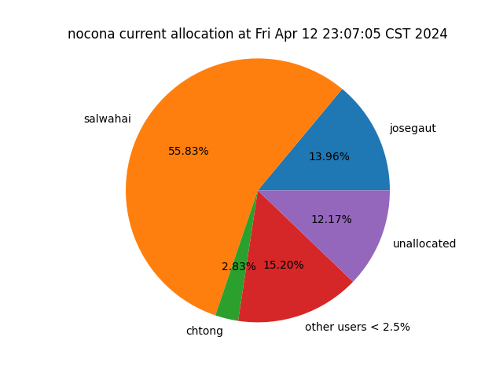
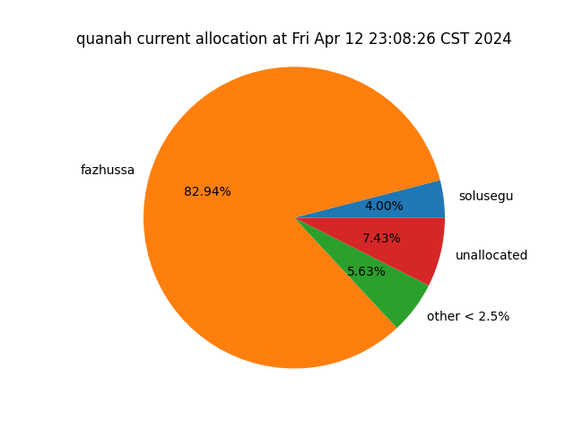

## check_sq

### check_sq HPCC alias

```bash
alias check_sq='bash /home/jerschro/Scripts/squeue/read_squeue.sh'

```

### check_sq Description

```
usage: check_sq [-h] USER

Prints percentage of usage for USER jobs on different HPCC Nodes.

Written by Jeremy Schroeder 3-1-2024

```

### check_sq Example Output

<details>
<summary>check_sq Example Output</summary>

```title="quanah:$ check_sq jerschro"
jerschro is currently using 387.3333333333333 quanah nodes, which is 82.9408% of quanah partition.
jerschro is currently using 134.0 nocona nodes, which is 55.8333% of nocona partition.

```
</details>

## check_usage

### check_usage HPCC alias

``` bash
alias check_usage='bash /home/jerschro/Scripts/squeue/pandas_squeue.sh'

```

### check_usage Description

```
usage: check_usage [-h]

Prints Top 20 current longest running jobs and percentage of usage for quanah and nocona partitions.

Written by Jeremy Schroeder 3-1-2024

```

### check_usage Example Output

<details>
<summary>check_usage Example Output</summary>

```title="quanah:$ check_usage"
-----------------------------------TOP 20 LONGEST JOBS CURRENTLY------------------------------------
         PARTITION      USER                                               NAME        TIME  NODES  CPUS       QOS  SECONDS
JOBID
12959869    nocona   aaquino                                       first-dimmer  8-05:06:09      1   128    aquino   709569
12973705    nocona  solusegu     /home/solusegu/urea/kinetics/Ag110/CO+NO/MLneb  1-19:57:04      1    32  gauthier   158224
12973707    nocona  solusegu   /home/solusegu/urea/kinetics/Ag110/COOH+NO/MLneb  1-19:55:23      1    32  gauthier   158123
12970899    nocona  rosutton                                               namd  1-18:39:40      5   640    normal   153580
12971796    quanah  aschueth                                                MAX  1-18:18:04      1     1    normal   152284
12970119    nocona  salwahai                                           RotProbe  1-17:12:23      8  1024    normal   148343
12970139    nocona  salwahai                                           RotProbe  1-16:57:33      1   128    normal   147453
12970120    nocona  salwahai                                           RotProbe  1-15:35:28      8  1024    normal   142528
12972064    nocona  josegaut  /home/josegaut/amorphous_irox/training_data_me...  1-15:16:59      1    64    normal   141419
12972063    nocona  josegaut  /home/josegaut/amorphous_irox/training_data_me...  1-15:16:59      1    64    normal   141419
12972068    nocona  josegaut  /home/josegaut/amorphous_irox/training_data_me...  1-15:11:57      1    64    normal   141117
12972065    nocona  josegaut  /home/josegaut/amorphous_irox/training_data_me...  1-15:11:57      1    64    normal   141117
12972066    nocona  josegaut  /home/josegaut/amorphous_irox/training_data_me...  1-15:11:57      1    64    normal   141117
12972067    nocona  josegaut  /home/josegaut/amorphous_irox/training_data_me...  1-15:11:57      1    64    normal   141117
12972070    nocona  josegaut  /home/josegaut/amorphous_irox/training_data_me...  1-15:06:56      1    64    normal   140816
12972069    nocona  josegaut  /home/josegaut/amorphous_irox/training_data_me...  1-15:06:56      1    64    normal   140816
12972072    nocona  josegaut  /home/josegaut/amorphous_irox/training_data_me...  1-15:01:54      1    64    normal   140514
12972071    nocona  josegaut  /home/josegaut/amorphous_irox/training_data_me...  1-15:01:54      1    64    normal   140514
12972073    nocona  josegaut  /home/josegaut/amorphous_irox/training_data_me...  1-14:56:53      1    64    normal   140213
12972074    nocona  josegaut  /home/josegaut/amorphous_irox/training_data_me...  1-14:51:51      1    64    normal   139911


-----nocona current allocation-----
USER           CPUS    NODES      %
-----------  ------  -------  -----
salwahai      17152   134.00  55.83
josegaut       4480    35.00  14.58
unallocated    3470    27.11  11.30
chtong          840     6.56   2.73
rosutton        640     5.00   2.08
xinyawu         640     5.00   2.08
zhutang         640     5.00   2.08
jipkang         512     4.00   1.67
mhajianz        320     2.50   1.04
mpourasg        256     2.00   0.83
tericson        256     2.00   0.83
tristfis        256     2.00   0.83
lbraga          224     1.75   0.73


-----quanah current allocation-----
USER           CPUS    NODES      %
-----------  ------  -------  -----
fazhussa      13944   387.33  82.94
unallocated    1277    35.47   7.60
solusegu        608    16.89   3.62
ksonibar        360    10.00   2.14
ypokhrel        300     8.33   1.78
mmarasch         90     2.50   0.54
josegaut         72     2.00   0.43
guiyli           40     1.11   0.24


```
</details>

## nocona_pie

*nocona_pie uses X11 Forwarding*

### nocona_pie HPCC alias

``` bash
alias nocona_pie='bash /home/jerschro/Scripts/squeue/nocona_pie.sh'

```

### nocona_pie Description

```
usage: nocona_pie [-h]

Generates pie chart of current allocation for nocona partition.

Written by Jeremy Schroeder 3-1-2024

```

### nocona_pie Example Output



## quanah_pie

*quanah_pie uses X11 Forwarding*

### quanah_pie HPCC alias

``` bash
alias quanah_pie='bash /home/jerschro/Scripts/squeue/quanah_pie.sh'

```

### quanah_pie Description

```
usage: quanah_pie [-h]

Generates pie chart of current allocation for quanah partition.

Written by Jeremy Schroeder 3-1-2024

```

### quanah_pie Example Output


